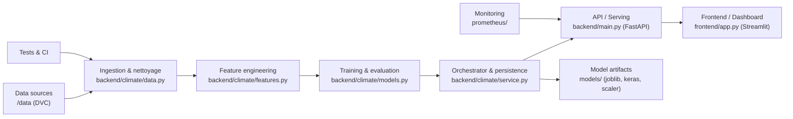

# Climate MLops Project

Résumé
------
Ce projet est une démonstration MLOps pour un modèle de prévision climatique. Il inclut :
- Entraînement et évaluation de modèles (sklearn, XGBoost, TensorFlow)
- Enregistrement des artefacts et résumé local
- Pipeline de promotion de modèles (quality gates) avec possibilité d'intégration MLflow
- Intégration DVC pour les données
- CI GitHub Actions pour tests et lint

Architecture
------------

Les composants principaux :

- `backend/` : API FastAPI et logique d'entraînement/prédiction
  - `backend/main.py` : endpoints FastAPI (`/health`, `/status`, `/train`, `/metrics`, `/forecast`)
  - `backend/train.py` : point d'entrée CLI et fonction `run_training()` utilisée dans les tests
  - `backend/climate/` : code métier (données, features, modèles, service)
    - `data.py` : chargement et préparation des données (DVC)
    - `features.py` : transformations et split temporel
    - `models.py` : définition et entraînement des modèles candidats
    - `service.py` : façade `ClimateService` qui orchestre entraînement, sauvegarde et prévisions

- `frontend/` : UI légère (streamlit ou app) qui consomme l'API backend
- `models/` : artefacts produits (modèles, `climate_summary.json`, `production.json`)
- `data/` : données versionnées par DVC (non commitées dans le repo)
- `scripts/` : utilitaires
  - `scripts/quality_gates.py` : exécute les quality gates (RMSE, latence, smoke tests) et promeut le modèle via MLflow ou marque localement

- `Dockerfile.backend`, `Dockerfile.frontend`, `docker-compose.yml` : conteneurisation et orchestration locale
- `.github/workflows/` : workflows CI (tests et promotion)

Flow de promotion (résumé)
-------------------------

1. Entraînement : `python -m backend.train --refresh` (ou via `docker compose` pipeline). Le meilleur modèle est identifié.
2. Enregistrement : si `MLFLOW_TRACKING_URI` est configuré, le meilleur modèle est loggé et inscrit dans le Model Registry (`Climate_Model`). Sinon, les artefacts sont sauvegardés localement (`models/climate_summary.json`).
3. Déploiement Staging : Docker compose démarre le service backend pour tester la version candidate.
4. Quality Gates : `scripts/quality_gates.py` vérifie des gates (ex. RMSE threshold, latency, smoke test).
5. Promotion : si toutes les gates passent, le script promeut la version dans MLflow (ou écrit `models/production.json` en fallback). Si une gate échoue, la production n'est pas modifiée.

Commandes communes
------------------

- Build & démarrer tout localement :
```bash
docker compose up -d --build
```
- Suivre les logs du pipeline :
```bash
docker compose logs -f pipeline
```
- Lancer l'entraînement localement (sans docker) :
```bash
python -m backend.train --refresh
```
- Exécuter les quality gates localement :
```bash
python scripts/quality_gates.py
```
- Tests & lint (local) :
```bash
pip install -r requirements-backend.txt
pip install -r requirements-dev.txt
black --check .
ruff check .
pytest -q
```

Configuration CI / Secrets
-------------------------

Pour activer la promotion via MLflow (ex : DagsHub) et exécuter `dvc pull` dans CI, ajoutez ces secrets dans GitHub :
- `MLFLOW_TRACKING_URI` (ex: `https://dagshub.com/OWNER/REPO.mlflow`)
- `MLFLOW_TRACKING_USERNAME` et `MLFLOW_TRACKING_PASSWORD` (si nécessaires)
- `DAGSHUB_USER_TOKEN`, `DAGSHUB_REPO_OWNER` (si vous utilisez DagsHub pour DVC)

Notes importantes
---------------

- Les données sont versionnées avec DVC et stockées en remote : `data/` n'est pas obligatoire en CI. Les tests de données skipent si les fichiers DVC manquent.
- Le pipeline supporte deux modes pour la promotion :
  - MLflow remote (préféré) — nécessite `MLFLOW_TRACKING_URI` configuré
  - Fallback local — crée `models/production.json` comme marqueur
- Si vous voulez activer GPU, configurez `MLFLOW`/Docker pour utiliser `nvidia-container-toolkit` et une image TF GPU.

Structure des fichiers (rapide)
-----------------------------

- `README.md` — ce fichier
- `docker-compose.yml` — services `backend`, `frontend`, `pipeline` (exécute training + gates)
- `requirements-backend.txt` — dépendances runtime
- `requirements-dev.txt` — outils de lint / test
- `scripts/quality_gates.py` — implémentation des gates & promotion
- `backend/` — code applicatif (voir ci‑dessus)
- `tests/` — suite de tests unitaires

Contact / Prochaine étape
------------------------

Si vous voulez :
- j'ajoute un README plus détaillé avec diagramme mermaid ;
- j'ajoute un script `ci-local.sh` pour exécuter les checks localement avant push ;
- j'active l'affichage de `models/production.json` dans les logs CI.

Bonne continuation — dites-moi quelle option vous voulez que j'ajoute en priorité.
# Climate ML MLOps Project

Application MLOps pour comparer plusieurs modèles de régression sur l'évolution conjointe des anomalies de température globale et du CO2 atmosphérique.

Le projet suit une architecture simple mais complète :

- un backend FastAPI qui prépare les données, entraîne les modèles et sert les prévisions ;
- un frontend Streamlit qui consomme l'API ou le service local ;
- des jeux de données bruts dans `data/` ;
- des artefacts modèles persistés dans `models/` ;
- le versionnement des jeux de données et des modèles avec DVC ;
- le suivi des expériences (métriques, paramètres, modèles) avec MLflow, hébergé sur DagsHub ;
- une CI GitHub Actions pour exécuter les tests ;
- une orchestration Docker Compose pour lancer backend et frontend ensemble.

## Architecture globale

Cette section décrit l'architecture applicative et les pratiques DevOps / MLOps liées au projet : tests, environnements (staging / production), déploiement, promotion de modèles, et observabilité.

### Vue d'ensemble



### Principes clés
- Reproductibilité : les données et artefacts sont versionnés avec DVC (`data/`, `models/`) ; `dvc pull` est requis après `git pull`.
- Isolation : `DATA_DIR` et `MODEL_DIR` sont configurables via variables d'environnement (voir `backend/climate/settings.py`).
- Promotion contrôlée : quality gates (scripts/quality_gates.py) valident les métriques avant promotion en production (MLflow / fallback local).
- Observabilité : métriques & exposition applicative + Prometheus pour scrapping et alerting.

### Testing (strategie)
- Unit tests : `pytest` pour fonctions de préparation des données, logique métier et points d'entrée (ex : `tests/test_data.py`, `tests/test_training_entrypoint.py`).
- Data tests : tests qui valident la présence et la structure des fichiers DVC ; ceux-ci sont conçus pour `skip` en CI si les artefacts DVC ne sont pas présents.
- Integration / smoke tests : exécuter le backend via Docker Compose puis lancer un petit script de vérification (`/health`, `/status`, endpoints `/forecast`).
- Lint & format : `ruff` et `black` via `pre-commit` et CI.

Commandes courantes pour tests locaux :
```bash
pip install -r requirements-dev.txt
pytest -q
black --check .
ruff check .
```

### Environnements & staging
- Staging : déployer l'image candidate dans un environnement isolé (docker compose ou k8s namespace) et exécuter les quality gates et smoke tests.
- Production : promotion explicite via MLflow Model Registry ou écriture de `models/production.json` en fallback.
- Promotion safe-by-design : la promotion ne doit être possible que si les gates (RMSE, latence, smoke tests) passent.

Recommandation de workflow Git :
- `main` → production stable
- `staging` → image candidate déployée automatiquement par CI/CD
- feature branches → PR vers `staging` puis tests & gates

### CI / CD et automation
- CI (GitHub Actions) :
  - Installe les dépendances backend et dev
  - Exécute lint, format, unit tests
  - Optionnel : `dvc pull` + tests d'intégration si secrets DVC/MLflow configurés
- CD (promotion) :
  - Pipeline de promotion déclenchée manuellement ou via merge sur `staging`
  - `scripts/quality_gates.py` exécute les validations et appelle MLflow/DagsHub si configuré
  - En cas de succès, modèle promu dans MLflow Model Registry; sinon, publication locale de `models/production.json`

### Déploiement
- Local / dev : `docker compose up --build` démarre `backend`, `frontend` et services annexes.
- Staging / Production : recommander d'utiliser un orchestrateur (Kubernetes) pour scalabilité ; images Docker construites depuis `Dockerfile.backend` et `Dockerfile.frontend`.
- Variables sensibles : stocker dans le gestionnaire de secrets de la plateforme (GitHub Secrets, Kubernetes Secrets) et charger via `.env` pour local.

### Observabilité & monitoring
- Exposer métriques applicatives (endpoint `/metrics`) et scrapper avec Prometheus (config dans `prometheus/prometheus.yml`).
- Exporter logs structurés (JSON) et définir alertes basées sur erreurs/latence ou dérive de métriques modèle.

### Gestion des artefacts & rollback
- Artefacts persistés dans `models/` et versionnés via DVC. Les meilleurs modèles sont enregistrés dans MLflow quand disponible.
- Rollback : rétablir la version précédemment promue depuis le Model Registry ou restaurer `models/` via DVC/`git checkout` + `dvc pull`.

---

# Structure du projet

## Racine

- `README.md` : documentation d'architecture, d'exécution et de maintenance.
- `docker-compose.yml` : orchestration des services backend et frontend.
- `Dockerfile.backend` : image Docker du backend FastAPI.
- `Dockerfile.frontend` : image Docker du frontend Streamlit.
- `requirements.txt` : dépendances du frontend et des usages légers.
- `requirements-backend.txt` : dépendances complètes du backend.
- `requirements-dev.txt` : dépendances pour les outils de qualité de code.
- `.env.example` : modèle des variables d'environnement nécessaires (DagsHub/MLflow). À copier en `.env` (jamais commité) avec les vraies valeurs.
- `load-env.ps1` : script PowerShell pour charger les variables du `.env` dans la session courante (nécessaire sous Windows avant `python -m backend.train`). Si l'exécution est bloquée par la politique PowerShell, lancer d'abord `Set-ExecutionPolicy -Scope Process -ExecutionPolicy Bypass` dans la même session.
- `.pre-commit-config.yaml` : configuration des hooks pre-commit.
- `.dvc/` : configuration de DVC et du stockage distant.
- `data.dvc` : suivi de version du dossier `data`.
- `models.dvc` : suivi de version du dossier `models`.
- `models/` : répertoire de persistance des artefacts entraînés.
- `data/` : jeu de données principal utilisé par le code.
- `tests/` : tests automatisés.
- `.github/workflows/` : pipeline GitHub Actions.
- `.gitignore` : exclusions Git.

## Backend

- `backend/__init__.py` : marque le package Python `backend`.
- `backend/main.py` : point d'entrée FastAPI. Déclare les routes `/health`, `/status`, `/train`, `/metrics` et `/forecast`.
- `backend/train.py` : script CLI pour entraîner ou ré-entraîner les modèles depuis le terminal.
- `backend/climate/__init__.py` : exports publics du sous-module météo.
- `backend/climate/settings.py` : définit les chemins projet (`data/`, `models/`), crée les dossiers nécessaires, et lit la configuration MLflow/DagsHub depuis les variables d'environnement.
- `backend/climate/data.py` : charge les CSV, nettoie les colonnes, fusionne température et CO2, construit le dataset principal et les lags.
- `backend/climate/features.py` : définit les colonnes d'entrée et le découpage temporel train/test.
- `backend/climate/models.py` : construit et entraîne les modèles classiques et optionnels deep learning, puis calcule RMSE, MAE et R².
- `backend/climate/forecasting.py` : génère les dates futures, projette le CO2 et produit les prévisions de température.
- `backend/climate/service.py` : orchestre tout le pipeline, persiste l'état, charge les artefacts, expose les métriques, fabrique les réponses de prévision, et journalise chaque entraînement dans MLflow si configuré.

## Frontend

- `frontend/app.py` : interface Streamlit. Affiche les métriques, les graphiques historiques et la prévision future. Peut communiquer avec le backend via `BACKEND_URL` ou utiliser directement le service local.

## Données

- `data/GLB.Ts+dSST.csv` : source des anomalies de température globale.
- `data/co2_mm_mlo.csv` : source des mesures de CO2 atmosphérique.

## Artefacts

- `models/climate_artifacts.joblib` : état sérialisé du pipeline après entraînement.
- `models/climate_summary.json` : résumé lisible de l'entraînement.
- `models/*.keras` : modèles deep learning sauvegardés.
- `models/dl_scaler.joblib` : scaler utilisé pour ANN/CNN/GCN.
- `models/.gitkeep` : conserve le dossier dans Git lorsqu'il est vide.

## Tests et CI

- `tests/test_data.py` : vérifie que les frames de données sont construites correctement et contiennent les colonnes attendues.
- `.github/workflows/ci.yml` : installe les dépendances backend puis exécute automatiquement les tests avec `pytest`. Le job est déjà prêt à recevoir un secret `DAGSHUB_USER_TOKEN` pour une future intégration MLflow en CI (non utilisée pour l'instant, voir section dédiée plus bas).

---

# Comment chaque couche communique

- Le frontend appelle d'abord l'API backend si `BACKEND_URL` est défini.
- Sinon, Streamlit instancie directement `ClimateService` pour un mode local.
- `ClimateService` charge ou entraîne les modèles, puis persiste les artefacts dans `models/`.
- Les prévisions s'appuient sur l'historique, les lags temporels et une projection du CO2.
- Les jeux de données et les modèles sont versionnés avec DVC afin de garantir la reproductibilité des entraînements.

---

# Lancer en local

1. Installer les dépendances frontend.

```bash
pip install -r requirements.txt
```

2. Installer les dépendances backend.

```bash
pip install -r requirements-backend.txt
```

3. Installer les outils de développement (optionnel).

```bash
pip install -r requirements-dev.txt
```

4. Télécharger les données et modèles versionnés avec DVC.

```bash
dvc pull
```

> ⚠️ Toujours faire `dvc pull` (après un `git pull`) avant de lancer un entraînement ou de démarrer l'application, afin de travailler sur les dernières données et les derniers modèles versionnés. Sans ce pull, `data/` et `models/` peuvent contenir une version locale obsolète ou incomplète.

5. Démarrer l'API backend.

```bash
uvicorn backend.main:app --reload --port 8000
```

6. Démarrer Streamlit.

```bash
streamlit run frontend/app.py
```

---

# Versionnement des données

Le projet utilise **DVC (Data Version Control)** afin de gérer les jeux de données et les modèles indépendamment du dépôt Git.

Les dossiers suivis par DVC sont :

- `data/`
- `models/`

Les fichiers `data.dvc` et `models.dvc` permettent de retrouver précisément la version des données utilisée lors d'un entraînement.

Les données sont stockées sur un stockage distant DVC tandis que Git ne versionne que les métadonnées (`*.dvc`).

## Configuration du remote DagsHub (par personne)

Le remote `dagshub` est déjà déclaré dans `.dvc/config` (fichier commité, ne contient que l'URL). Chaque membre de l'équipe doit en revanche configurer **ses propres identifiants** dans `.dvc/config.local` (fichier non commité, ignoré par Git) :

```bash
dvc remote modify dagshub --local auth basic
dvc remote modify dagshub --local user <votre-nom-utilisateur-dagshub>
dvc remote modify dagshub --local password <votre-token-dagshub>
```

Le `<votre-token-dagshub>` est le même token que celui utilisé pour `DAGSHUB_USER_TOKEN` dans `.env` (voir section MLflow ci-dessous) — c'est le même token DagsHub, mais il doit être renseigné séparément à deux endroits différents (`.dvc/config.local` pour DVC, `.env` pour MLflow), car les deux outils ne partagent aucune configuration entre eux.

**Ne mettez jamais votre token dans `.dvc/config`** (celui commité) : `user`, `auth` et `password` doivent uniquement vivre dans `.dvc/config.local`.

## Récupérer les dernières données

Avant toute session de travail (entraînement, exploration, lancement de l'application), toujours synchroniser code et données dans cet ordre :

```bash
git pull
dvc pull
```

`git pull` récupère les derniers pointeurs `data.dvc` / `models.dvc`, et `dvc pull` télécharge le contenu réel correspondant depuis le remote DagsHub. Sauter cette étape peut faire travailler sur une version de données périmée, incomplète, voire vide.

## Mise à jour des données

Après modification des données :

```bash
dvc add data
git add data.dvc
git commit -m "Update dataset"
dvc push
git push
```

Les autres membres de l'équipe récupèrent ensuite les nouvelles données avec :

```bash
git pull
dvc pull
```

Chaque version des données est ainsi associée à un commit Git, ce qui garantit la reproductibilité des entraînements.

---

# Suivi des expériences avec MLflow (DagsHub)

Le projet peut journaliser chaque entraînement (paramètres, métriques RMSE/MAE/R², modèles) dans **MLflow**, hébergé gratuitement par **DagsHub**. Ce suivi est optionnel : si aucune configuration n'est fournie, l'entraînement fonctionne exactement comme avant, sans aucun appel à MLflow.

## Configuration

1. Récupérer un token DagsHub : sur [dagshub.com](https://dagshub.com), avatar (haut à droite) → **Settings** → **Tokens**. Le **Default Access Token** convient très bien pour un usage personnel.
2. Copier `.env.example` en `.env` à la racine du projet, puis renseigner :

```
DAGSHUB_USER_TOKEN=<votre-token>
DAGSHUB_REPO_OWNER=kevin-71
DAGSHUB_REPO_NAME=climate-mlops
MLFLOW_EXPERIMENT_NAME=climate-ml
```

3. **Ne jamais commiter `.env`** (il doit rester dans `.gitignore`). Chaque membre de l'équipe génère et utilise **son propre token**, afin que les runs MLflow soient correctement attribués à leur auteur.

4. Charger les variables d'environnement avant de lancer l'entraînement. Windows/PowerShell ne lit pas automatiquement un fichier `.env`, contrairement à `export $(cat .env | xargs)` sous Linux/macOS. Un script `load-env.ps1` est fourni à la racine du projet pour ça :

```powershell
.\load-env.ps1
```

Si PowerShell bloque l'exécution du script (politique d'exécution non signée), lancer d'abord dans la même session :

```powershell
Set-ExecutionPolicy -Scope Process -ExecutionPolicy Bypass
.\load-env.ps1
```

Sous Linux/macOS, l'équivalent est :

```bash
export $(grep -v '^#' .env | xargs)
```

## Lancer un entraînement journalisé

Avant de lancer l'entraînement, s'assurer d'avoir les dernières données :

```bash
git pull
dvc pull
```

Puis lancer l'entraînement :

```bash
python -m backend.train --refresh
```

Chaque appel à `ClimateService.train()` ouvre un run parent MLflow (`climate-training`), puis un run imbriqué par modèle (Linear Regression, Decision Tree, Random Forest, XGBoost, ANN, CNN, GCN) avec ses hyperparamètres, ses métriques et son artefact modèle. Les résultats sont visibles dans l'onglet **Experiments** du dépôt DagsHub.

## CI (à venir)

Le pipeline `.github/workflows/ci.yml` est déjà prêt à recevoir la configuration DagsHub via un secret GitHub nommé `DAGSHUB_USER_TOKEN` (Settings du dépôt → Secrets and variables → Actions), mais la CI n'exécute pour l'instant que les tests (`pytest`) et ne lance pas d'entraînement complet. Cette intégration sera activée plus tard si l'on souhaite journaliser automatiquement des runs à chaque push.

---

# Qualité de code

Le projet automatise le formatage et le linting grâce à **pre-commit**.

Installation :

```bash
pip install -r requirements-dev.txt
pre-commit install
```

À chaque `git commit`, les hooks exécutent automatiquement les vérifications et les corrections nécessaires afin de maintenir une qualité de code homogène.

---

# Collaboration

Le code source est versionné avec Git tandis que les données et les modèles sont versionnés avec DVC.

Workflow recommandé :

```text
git clone
        │
        ▼
pip install -r requirements-backend.txt
        │
        ▼
dvc pull
        │
        ▼
Lancement de l'application
```

Lorsqu'un membre de l'équipe met à jour les données :

```bash
dvc add data
git add data.dvc
git commit -m "Update dataset"
dvc push
git push
```

Les autres développeurs synchronisent ensuite leur environnement avec :

```bash
git pull
dvc pull
```

> À faire systématiquement en début de session de travail, même si aucune donnée n'a été mise à jour récemment : c'est le seul moyen de garantir que `data/` et `models/` en local correspondent bien à la dernière version partagée par l'équipe.

---

# Avec Docker Compose

```bash
docker compose up --build
```

Le backend est accessible sur :

```
http://localhost:8000
```

Le frontend Streamlit est accessible sur :

```
http://localhost:8501
```

---

# Données

Les fichiers sources sont détectés automatiquement dans `data/`, versionnés avec DVC. Toujours exécuter `dvc pull` (après `git pull`) pour s'assurer de disposer de la dernière version avant de travailler dessus.