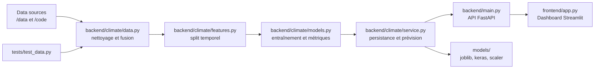

# Climate ML MLOps Project

Application MLOps pour comparer plusieurs modèles de régression sur l'évolution conjointe des anomalies de température globale et du CO2 atmosphérique.

Le projet suit une architecture simple mais complète:
- un backend FastAPI qui prépare les données, entraîne les modèles et sert les prévisions;
- un frontend Streamlit qui consomme l'API ou le service local;
- des jeux de données bruts dans `data/` avec compatibilité legacy vers `code/`;
- des artefacts modèles persistés dans `models/`;
- une CI GitHub Actions pour exécuter les tests;
- une orchestration Docker Compose pour lancer backend et frontend ensemble.

## Architecture globale



Flux de données principal:
1. Les CSV sont lus depuis `data/`, avec repli sur `code/` si nécessaire.
2. `backend/climate/data.py` fusionne température et CO2, puis crée un frame exploitable.
3. `backend/climate/features.py` construit le split temporel et les variables d'entrée.
4. `backend/climate/models.py` entraîne les modèles classiques et, si disponible, les modèles deep learning.
5. `backend/climate/service.py` stocke l'état, charge les artefacts et génère les prévisions futures.
6. `backend/main.py` expose ces capacités via HTTP.
7. `frontend/app.py` affiche les résultats, les métriques et la projection.

## Structure du projet

### Racine

- `README.md` : documentation d'architecture, d'exécution et de maintenance.
- `docker-compose.yml` : orchestration des services backend et frontend.
- `Dockerfile.backend` : image Docker du backend FastAPI.
- `Dockerfile.frontend` : image Docker du frontend Streamlit.
- `requirements.txt` : dépendances du frontend et des usages légers.
- `requirements-backend.txt` : dépendances complètes du backend, incluant les tests et les modèles de régression/ deep learning.
- `models/` : répertoire de persistance des artefacts entraînés.
- `data/` : jeu de données principal utilisé par le code.
- `code/` : ancien emplacement des données, conservé pour compatibilité.
- `tests/` : tests automatisés.
- `.github/workflows/` : pipeline GitHub Actions.
- `.gitignore` : exclusions Git.

### Backend

- `backend/__init__.py` : marque le package Python `backend`.
- `backend/main.py` : point d'entrée FastAPI. Déclare les routes `/health`, `/status`, `/train`, `/metrics` et `/forecast`.
- `backend/train.py` : script CLI pour entraîner ou ré-entraîner les modèles depuis le terminal.
- `backend/climate/__init__.py` : exports publics du sous-module météo.
- `backend/climate/settings.py` : définit les chemins projet (`data/`, `code/`, `models/`) et crée les dossiers nécessaires.
- `backend/climate/data.py` : charge les CSV, nettoie les colonnes, fusionne température et CO2, construit le dataset principal et les lags.
- `backend/climate/features.py` : définit les colonnes d'entrée et le découpage temporel train/test.
- `backend/climate/models.py` : construit et entraîne les modèles classiques et optionnels deep learning, puis calcule RMSE, MAE et R².
- `backend/climate/forecasting.py` : génère les dates futures, projette le CO2 et produit les prévisions de température.
- `backend/climate/service.py` : orchestre tout le pipeline, persiste l'état, charge les artefacts, expose les métriques et fabrique les réponses de prévision.

### Frontend

- `frontend/app.py` : interface Streamlit. Affiche les métriques, les graphiques historiques et la prévision future. Peut parler au backend distant via `BACKEND_URL` ou utiliser le service local.

### Données

- `data/GLB.Ts+dSST.csv` : source des anomalies de température globale.
- `data/co2_mm_mlo.csv` : source des mesures de CO2 atmosphérique.
- `code/GLB.Ts+dSST.csv` et `code/co2_mm_mlo.csv` : copies héritées gardées comme secours si `data/` n'est pas disponible.

### Artefacts

- `models/climate_artifacts.joblib` : état sérialisé du pipeline après entraînement.
- `models/climate_summary.json` : résumé lisible de l'entraînement.
- `models/*.keras` : modèles deep learning sauvegardés.
- `models/dl_scaler.joblib` : scaler utilisé pour ANN/CNN/GCN.
- `models/.gitkeep` : garde le dossier dans le dépôt même lorsqu'il est vide.

### Tests et CI

- `tests/test_data.py` : vérifie que les frames de données sont construites correctement et contiennent les colonnes attendues.
- `.github/workflows/ci.yml` : installe les dépendances backend puis exécute la suite avec `python -m pytest -q`.

## Comment chaque couche communique

- Le frontend appelle d'abord l'API backend si `BACKEND_URL` est défini.
- Sinon, Streamlit instancie directement `ClimateService` pour un mode local.
- `ClimateService` charge ou entraîne les modèles, puis persiste les artefacts dans `models/`.
- Les prévisions s'appuient sur l'historique, les lags temporels et une projection du CO2.

## Lancer en local

1. Installer les dépendances frontend.
   ```bash
   pip install -r requirements.txt
   ```
2. Installer les dépendances backend.
   ```bash
   pip install -r requirements-backend.txt
   ```
3. Démarrer l'API backend.
   ```bash
   uvicorn backend.main:app --reload --port 8000
   ```
4. Démarrer Streamlit.
   ```bash
   streamlit run frontend/app.py
   ```

## Avec Docker Compose

```bash
docker compose up --build
```

Le service backend expose l'API sur `http://localhost:8000` et Streamlit sur `http://localhost:8501`.

## Données

Les fichiers sources sont détectés automatiquement dans `data/`. Si besoin, le code lit aussi l'ancien dossier `code/` pour rester compatible avec les anciens jeux de données.
